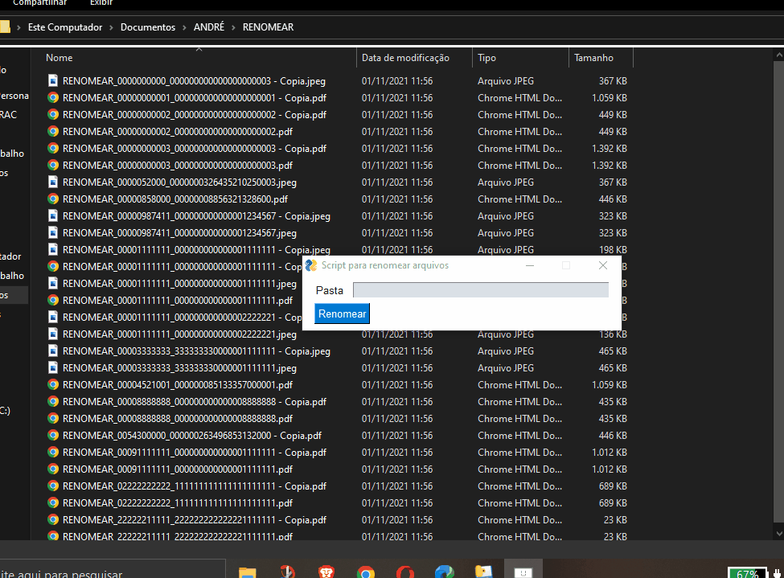

# Script-para-renomear-arquivos

## Descrição:
> Este script foi desenvolvido para solucionar um problema que era existente na empresa em que estou estagiando no momento,  a problemática existia pelo fato de ser necessário renomear mais de 250 arquivos por dia.  
O script foi desenvolvido para renomear especificamente os arquivos que trabalhamos, caso seja necessário fazer outro tipo de renomeação, será necessário mudar o código.
***

## Como usar:
> Para usar o script você deve: 
> * baixar o repositório em sua máquina;
> * abrir a pasta 'dist';
> * abrir a pasta 'script';
> * e por fim executar o arquivo 'script.exe'.
  
  Agora o script estará rodando, para usa-lo de fato, deve ser colado o endereço da pasta que contém os arquivos que devem ser renomeados, como é mostrado no tópico seguinte.
  ***

## Executando:
O script foi desenvolvido para trabalhar com arquivos que foram nomeado no formato "comprovante_1235522_625415946532", ele irá apagar tudo que tem a partir do segundo underline, assim ficará "comprovante_1235522".

### Passo a passo:
> * execute o sript;
> * copie o endereço da pasta que você quer renomear;
> * cole o endereço da pasta no campo dentro do script;
> * clique no botão 'Renomear';
> * aguarde poucos segundos enquanto os arquivos são renomeados.

### Ilustração da execução:
<h1 align="center">
  
</h1>
***
